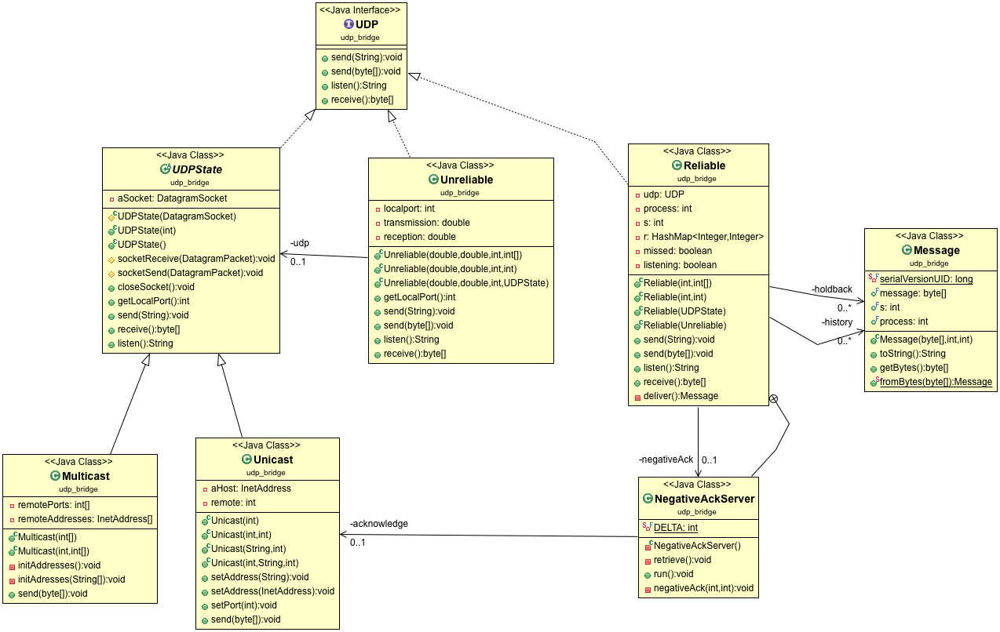

# SOEN423

## How to Use the UDP Bridge
The bridge is used to decouple the abstraction (UDP) from the implementation (Reliable, Unreliable...) of UDP. In our case we want a Unicast that is either reliable or unreliable(for testing purposes) as well as a Multicast that is reliable or unreliable. Thus, the bridge pattern makes sense here.

There is a slight variation to the pattern though. Both the UDP state (unicast, multicast) and the reliableness (reliable, unreliable) implement the same abstraction (UDP). That is because we want the client to both in the same manner.

### Regular UDP
Unicast:
```Java
UDP udp = new Unicast(localport,remoteport);
```
Multicast:
```Java
UDP udp = new Multicast(localport, remote1, remote2, remote3);
```

### Bridged UDP
Unreliable:
```Java
//Two first numbers are for degree of reliability of send and reception
UDP uni1 = new Unreliable(50,0,localport, remote);
UDP multi1 = new Unreliable(50,0,localport, remote1, remote2, remote3);
UDP uni2 = new Unreliable(50,0,localport, new Unicast(localport,remoteport));
UDP multi2 = new Unreliable(50,0,localport, new Multicast(localport, remote1, remote2, remote3));
```
_Keep in mind that Unreliable UDP is solely reserved for Testing purposes_

Reliable:
```Java
UDP multi1 = new Reliable(localport, remote1,remote2,remote3);
UDP multi2 = new Reliable(new Multicast(localport, remote1, remote2, remote3));
UDP uni1 = new Reliable(localport, remoteport);
UDP uni2 = new Reliable(new Multicast(localport, remoteport));
//and for testing purposes
UDP unreliable = new Reliable(new Unreliable(localport, remote1, remote2, remote3));
```



For now the process are identified with their port numbers only. 
Also, for now, UDP only supports a "localhost" address. Some things will have to change if we want to support remote addresses. For instance, different hosts may have the same ports open for UDP, which will break the Reliable UDP. For that reason, I did not implement a constructor accepting different addresses for Multicast, and Reliable UDP.
